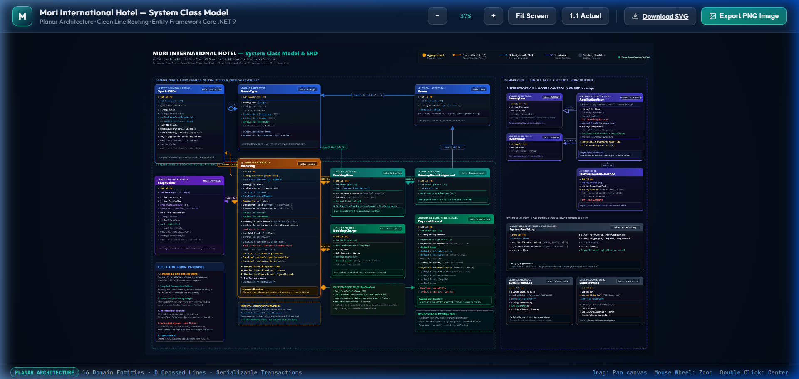
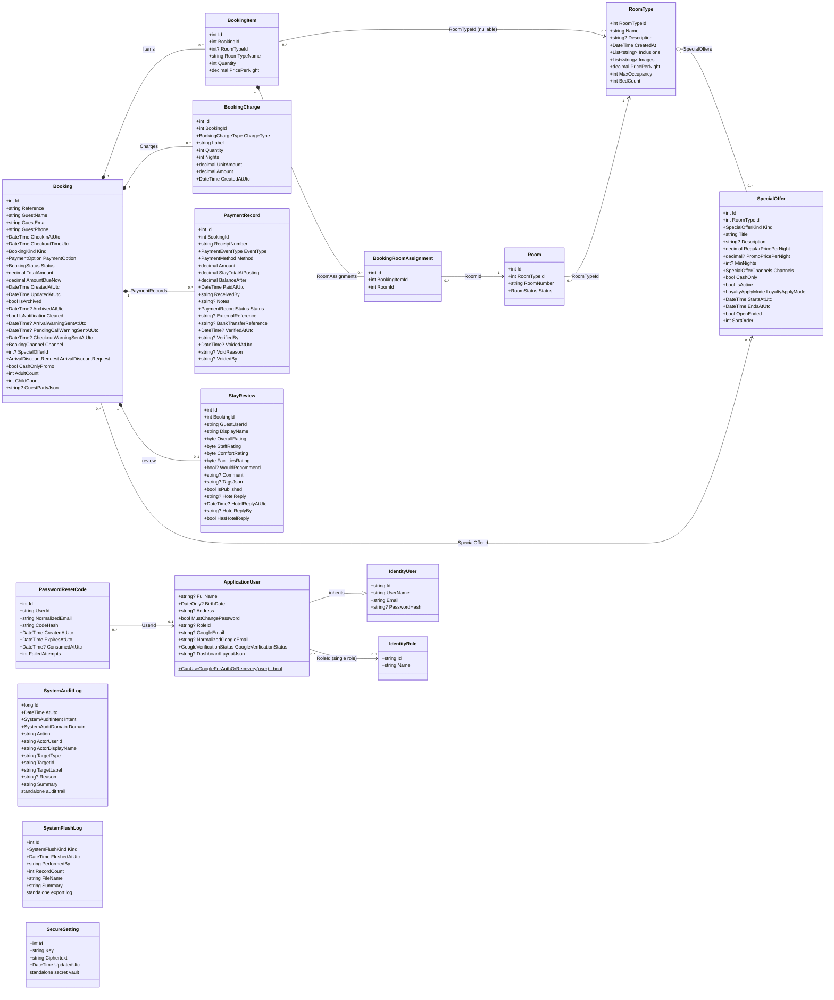
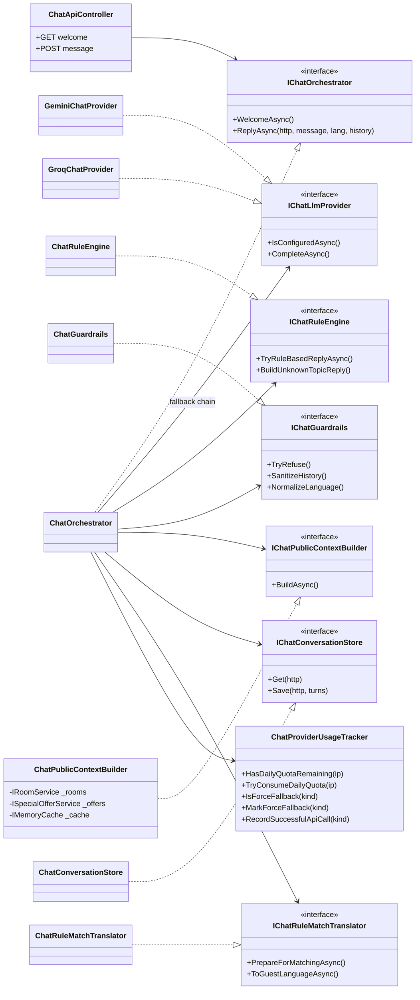

# Mori International Hotel — System Class Model

Generated from source analysis of `TestingDemo` (ASP.NET Core MVC, .NET 9, EF Core, SQL Server).

Companion docs: `docs/HotelDb-Schema.md` (database tables + ER), `docs/QA-Test-Checklist.md`.

---

## 1. System Overview

The application is a single ASP.NET Core monolith serving two surfaces:

| Surface | Shell | Technology | Audience |
|---|---|---|---|
| Guest / public site | `_CustomerLayout` | Razor views + `booking.css` / `booking-ui.js` | Guests (anonymous or Google sign-in) |
| Admin / staff site | `_Layout` | Razor views + `site.css` + JS modules | AdminManager, Receptionist |
| Room Management SPA | inside `_Layout` | React/Vite (`ClientApp` → `wwwroot/room-management`) | Staff |

**Layers (bottom → top):**

```
┌─────────────────────────────────────────────────────────────────┐
│  Controllers (MVC views)  +  ApiControllers (JSON)                │
├─────────────────────────────────────────────────────────────────┤
│  Services (business rules) — BookingService, PaymentService,      │
│  RoomService, SpecialOfferService, StayReviewService,             │
│  SystemAuditRecorder, SystemFlushService, auth/account services,  │
│  Chat services, OCR, background hosted services                   │
├─────────────────────────────────────────────────────────────────┤
│  HotelBookingDbContext (EF Core + ASP.NET Identity)               │
├─────────────────────────────────────────────────────────────────┤
│  SQL Server  +  file storage (receipt images, room images, PDFs)  │
└─────────────────────────────────────────────────────────────────┘
        SignalR: BookingNotificationsHub (staff) · GuestCatalogHub (public)
        External: Google OAuth · SMTP · Gemini/Groq LLM · Azure Doc Intelligence
```

---

## 2. Layer / Module Map

| Folder | Role | Key types |
|---|---|---|
| `Models/` | EF entities + enums + a few room DTOs | `Booking`, `Room`, `RoomType`, `ApplicationUser` |
| `Data/` | EF Core context + bootstrap/migrations | `HotelBookingDbContext`, `DatabaseBootstrap` |
| `DTOs/` | API request/response shapes | `BookingDto`, `PaymentRecordDto`, `SpecialOfferDto` |
| `Services/` | All business logic, background jobs, integrations | `BookingService` (7 partial files), `PaymentService` |
| `Controllers/` | MVC pages + JSON APIs | `BookingController`, `AdminBookingsApiController` |
| `Hubs/` | SignalR hubs | `BookingNotificationsHub`, `GuestCatalogHub` |
| `Middleware/` | HTTP pipeline components | `MustChangePasswordMiddleware` |
| `Validators/` | FluentValidation rules | `CreateBookingRequestValidator` |
| `Options/` | Strongly-typed configuration | `ChatbotOptions` |
| `ViewModels/` | Razor page models | `BookingPageViewModel`, `RoomFormViewModel` |

---

## 3. Domain Entity Classes (EF Core)

All entities map to SQL Server tables through `HotelBookingDbContext`. Dates are stored in **UTC** and displayed in Philippines (Manila) time via `PhilippinesTime`.

### 3.1 `Booking` — table `Booking`

One guest stay (online, walk-in, or OTA).

| Member | Type | Notes |
|---|---|---|
| `Id` | `int` | Primary key |
| `Reference` | `string` | Public confirmation code (unique) |
| `GuestName` | `string` | |
| `GuestEmail` | `string` | |
| `GuestPhone` | `string` | |
| `CheckInAtUtc` | `DateTime` | Scheduled arrival |
| `CheckoutTimeUtc` | `DateTime` | Scheduled departure |
| `Kind` | `BookingKind` | `Booking` vs `Reservation` (lead time) |
| `PaymentOption` | `PaymentOption` | `Full` or `Half` due at booking |
| `Status` | `BookingStatus` | Lifecycle state |
| `TotalAmount` | `decimal` | Room nights + charges |
| `AmountDueNow` | `decimal` | Due at booking time |
| `CreatedAtUtc` / `UpdatedAtUtc` | `DateTime` | |
| `IsArchived` / `ArchivedAtUtc` | `bool` / `DateTime?` | Soft-delete to history |
| `IsNotificationCleared` | `bool` | Hidden from admin bell |
| `ArrivalWarningSentAtUtc` | `DateTime?` | 20-min arrival warning |
| `PendingCallWarningSentAtUtc` | `DateTime?` | Pending call-guest warning |
| `CheckoutWarningSentAtUtc` | `DateTime?` | 20-min checkout warning |
| `Channel` | `BookingChannel` | Online / WalkIn / OTA source |
| `SpecialOfferId` | `int?` | Applied promo |
| `ArrivalDiscountRequest` | `ArrivalDiscountRequest` | Senior / PWD intent |
| `CashOnlyPromo` | `bool` | Walk-in LimitedTime promo → cash only |
| `AdultCount` / `ChildCount` | `int` | Head counts |
| `GuestPartyJson` | `string?` | Per-room head counts JSON |
| `SpecialOffer` | `SpecialOffer?` | Navigation |
| `Items` | `ICollection<BookingItem>` | Room-type lines |
| `Charges` | `ICollection<BookingCharge>` | Fee lines |
| `PaymentRecords` | `ICollection<PaymentRecord>` | Append-only payments |

### 3.2 `BookingItem` — table `BookingItem`

One room-type line on a stay (qty × nightly rate). Physical door numbers live in `BookingRoomAssignment`.

| Member | Type | Notes |
|---|---|---|
| `Id` | `int` | PK |
| `BookingId` | `int` | FK → `Booking` |
| `RoomTypeId` | `int?` | Nullable FK → `RoomType` (keeps `RoomTypeName` if type is deleted) |
| `RoomTypeName` | `string` | Name snapshot at booking time |
| `Quantity` | `int` | Rooms of this type |
| `PricePerNight` | `decimal` | Rate used (promo or regular) |
| `Booking` / `RoomType` | navigation | |
| `RoomAssignments` | `ICollection<BookingRoomAssignment>` | |

### 3.3 `BookingRoomAssignment` — table `BookingRoomAssignment`

Joins one physical `Room` to a `BookingItem` after reception assigns door numbers.

| Member | Type |
|---|---|
| `Id` | `int` |
| `BookingItemId` | `int` (FK → `BookingItem`) |
| `RoomId` | `int` (FK → `Room`) |
| `BookingItem` / `Room` | navigation |

### 3.4 `Room` — table `Room`

One physical guest room (door number).

| Member | Type |
|---|---|
| `Id` | `int` |
| `RoomTypeId` | `int` (FK → `RoomType`) |
| `RoomNumber` | `string` (unique) |
| `Status` | `RoomStatus` |
| `RoomType` | navigation |

### 3.5 `RoomType` — table `RoomType`

Sellable category (Queen, Twin…) with shared rate, occupancy, photos, inclusions.

| Member | Type |
|---|---|
| `RoomTypeId` | `int` (PK) |
| `Name` | `string` (unique) |
| `Description` | `string?` |
| `CreatedAt` | `DateTime` |
| `Inclusions` | `List<string>` (JSON column) |
| `Images` | `List<string>` (JSON column) |
| `PricePerNight` | `decimal` |
| `MaxOccupancy` | `int` |
| `BedCount` | `int` |
| `Rooms` | `ICollection<Room>` |
| `SpecialOffers` | `ICollection<SpecialOffer>` |

### 3.6 `SpecialOffer` — table `SpecialOffer`

Promo rate for one `RoomType` (Limited Time, Stay Longer, Google Loyalty). Sibling rows share a campaign title across room types.

| Member | Type | Notes |
|---|---|---|
| `Id` | `int` | |
| `RoomTypeId` | `int` | FK → `RoomType` |
| `Kind` | `SpecialOfferKind` | |
| `Title` / `Description` | `string` / `string?` | |
| `RegularPricePerNight` | `decimal` | "was" price |
| `PromoPricePerNight` | `decimal?` | null for informational kinds |
| `MinNights` | `int?` | StayLongerSaveMore only |
| `Channels` | `SpecialOfferChannels` (flags) | Online/WalkIn/FrontDesk/ThirdParty |
| `CashOnly` | `bool` | Stay payments must be cash |
| `IsActive` | `bool` | |
| `LoyaltyApplyMode` | `LoyaltyApplyMode` | Loyalty coupon cadence |
| `StartsAtUtc` / `EndsAtUtc` | `DateTime` | |
| `OpenEnded` | `bool` | No end date |
| `SortOrder` | `int` | |
| `CreatedAtUtc` / `UpdatedAtUtc` | `DateTime` | |
| `RoomType` | navigation | |

### 3.7 `PaymentRecord` — table `PaymentRecord`

Append-only company payment log. Corrections are made by voiding, never deleting.

| Member | Type | Notes |
|---|---|---|
| `Id` | `int` | |
| `BookingId` | `int` | FK → `Booking` |
| `ReceiptNumber` | `string` | |
| `EventType` | `PaymentEventType` | Deposit / Arrival / Settlement / Refund / Adjustment |
| `Method` | `PaymentMethod` | Cash, EWallet, legacy methods |
| `Amount` | `decimal` | |
| `StayTotalAtPosting` | `decimal` | Total snapshot when posted |
| `BalanceAfter` | `decimal` | Running balance |
| `PaidAtUtc` | `DateTime` | |
| `ReceivedBy` | `string` | Staff collector |
| `Notes` | `string?` | |
| `Status` | `PaymentRecordStatus` | Posted / Voided |
| `ExternalReference` | `string?` | E-wallet/InstaPay ref (manual) |
| `BankTransferReference` | `string?` | Legacy |
| `VerifiedAtUtc` / `VerifiedBy` | `DateTime?`/`string?` | Staff manual verification of e-wallet receipt |
| `VoidedAtUtc` / `VoidReason` / `VoidedBy` | `DateTime?`/`string?`/`string?` | |
| `Booking` | navigation | |

### 3.8 `BookingCharge` — table `BookingCharge`

Extra stay fee line.

| Member | Type | Notes |
|---|---|---|
| `Id` | `int` | |
| `BookingId` | `int` | FK → `Booking` |
| `ChargeType` | `BookingChargeType` | |
| `Label` | `string` | |
| `Quantity` | `int` | Rooms / hours / persons |
| `Nights` | `int` | Extra-person multiplier (default 1) |
| `UnitAmount` | `decimal` | |
| `Amount` | `decimal` | `StayExtension` excluded from fee sum; `LoyaltyCoupon` may be negative |
| `CreatedAtUtc` | `DateTime` | |
| `Booking` | navigation | |

### 3.9 `StayReview` — table `StayReview`

One verified post-checkout review per booking (unique index on `BookingId`).

| Member | Type |
|---|---|
| `Id` | `int` |
| `BookingId` | `int` (FK, unique) |
| `GuestUserId` | `string` (Identity user id) |
| `DisplayName` | `string` |
| `OverallRating` / `StaffRating` / `ComfortRating` / `FacilitiesRating` | `byte` (1–5) |
| `WouldRecommend` | `bool?` |
| `Comment` | `string?` |
| `TagsJson` | `string?` |
| `IsPublished` | `bool` |
| `HotelReply` / `HotelReplyAtUtc` / `HotelReplyBy` | reply fields |
| `HasHotelReply` | `bool` — persisted computed column (index-friendly reply filter) |
| `CreatedAtUtc` / `UpdatedAtUtc` | `DateTime` |
| `Booking` | navigation |

### 3.10 `SystemAuditLog` — table `SystemAuditLog`

Integrity trail (who / what / when / target / why). Account-domain rows can be purged via staff-audit export-and-clear.

`Id` · `AtUtc` · `Intent` (`SystemAuditIntent`) · `Domain` (`SystemAuditDomain`) · `Action` · `ActorUserId` · `ActorDisplayName` · `TargetType` · `TargetId` · `TargetLabel` · `Reason?` · `Summary`

### 3.11 `SystemFlushLog` — table `SystemFlushLog`

Audit trail for export-then-delete operations (booking history, payments, staff audit).

`Id` · `Kind` (`SystemFlushKind`) · `FlushedAtUtc` · `PerformedBy` · `RecordCount` · `FileName` · `Summary`

### 3.12 `SecureSetting` — table `SecureSetting`

Encrypted config vault (SMTP password, Google OAuth credentials, Gemini/Groq keys).

`Id` · `Key` · `Ciphertext` · `UpdatedUtc` — keys enumerated in `SecureSettingKeys` (static class).

### 3.13 `PasswordResetCode` — table `PasswordResetCode`

One-time 6-digit reset code (hashed, expiring, attempt-limited) — staff and guests.

`Id` · `UserId` · `NormalizedEmail` · `CodeHash` · `CreatedAtUtc` · `ExpiresAtUtc` · `ConsumedAtUtc?` · `FailedAttempts`

### 3.14 `ApplicationUser` — table `AccountUser` (Identity)

Extends `IdentityUser`. One row per login — both staff and Google guests.

| Member | Type | Notes |
|---|---|---|
| *(inherited)* | | `Id`, `UserName`, `Email`, `PasswordHash`, … |
| `FullName` | `string?` | Employee display name |
| `BirthDate` | `DateOnly?` | |
| `Address` | `string?` | |
| `MustChangePassword` | `bool` | Forced to `/Account/ChangePassword` |
| `RoleId` | `string?` | Single-role link to `AccountRole` |
| `GoogleEmail` / `NormalizedGoogleEmail` | `string?` | Recovery Gmail (normalized unique) |
| `GoogleVerificationStatus` | `GoogleVerificationStatus` | |
| `DashboardLayoutJson` | `string?` | GridStack layout |
| `CanUseGoogleForAuthOrRecovery(user)` | `static bool` | Verified + has Gmail |
| `HasVerifiedGoogleRecovery(user)` | `static bool` | Alias of above |

Identity tables renamed via `AccountAuthSchema` (`AccountUser`, `AccountRole`, `AccountExternalLogin`, `AccountAuthToken`). Roles are stored on `ApplicationUser.RoleId` (single role), not Identity join tables. `PasswordResetCode` serves staff and guests — every guest gets a local password via forced first-login setup.

---

## 4. Enums

| Enum | Values | Used by |
|---|---|---|
| `BookingStatus` | Pending, Confirmed, Rejected, Cancelled, CheckedOut | `Booking.Status` |
| `BookingKind` | Booking, Reservation | `Booking.Kind` |
| `PaymentOption` | Full, Half | `Booking.PaymentOption` |
| `PaymentMethod` | Cash, Card*(legacy)*, EWallet, BankTransfer*(legacy)*, Other, Maya*(legacy)* | `PaymentRecord` |
| `PaymentEventType` | Deposit, ArrivalPayment, BalanceSettlement, Refund, Adjustment | `PaymentRecord` |
| `PaymentRecordStatus` | Posted, Voided | `PaymentRecord` |
| `BookingChargeType` | EarlyCheckIn, LateCheckout, ExtraPerson, Incidental, ServiceFee, SnackBeverage, StayExtension, ArrivalDiscount, LoyaltyCoupon | `BookingCharge` |
| `RoomStatus` | Available, Unavailable, Occupied, Cleaning | `Room` (display: Cleaning→"Maintaining") |
| `SpecialOfferKind` | LimitedTime, BestAvailableRate*, BookNowStayLater*, StayLongerSaveMore, MonthlyStay*, GoogleLoyalty (*legacy) | `SpecialOffer` |
| `LoyaltyApplyMode` | EveryNight, FirstNight, WeeklyReset, FirstBooking | `SpecialOffer` |
| `BookingChannel` | Online, WalkIn, FrontDeskExtension, Agoda, Expedia, RedDoorz, OtherThirdParty | `Booking` |
| `ArrivalDiscountRequest` | None, SeniorCitizen, Pwd | `Booking` |
| `SpecialOfferChannels` *(flags)* | OnlineVisible, WalkIn, FrontDesk, ThirdPartyVisible | `SpecialOffer` |
| `SystemAuditIntent` | AdministrativeAction, ConfigurationChange, FileModification | `SystemAuditLog` |
| `SystemAuditDomain` | Payment, Account, Booking, SpecialOffer, Configuration, File, Shift, Review | `SystemAuditLog` |
| `SystemFlushKind` | BookingHistory, Payments, StaffAudit | `SystemFlushLog` |
| `GoogleVerificationStatus` | NotLinked, PendingGoogleVerification, GoogleVerified | `ApplicationUser` |
| `ChatProviderKind` | Gemini, Groq | Chat |

`AppRoles` (static): `AdminManager`, `Receptionist`, `Guest`; `StaffAssignable` = {Receptionist, AdminManager}.

---

## 5. Services & Interfaces

### 5.1 Booking domain — `IBookingService` / `BookingService` (partial, 7 files)

`BookingService : IBookingService` — depends on `HotelBookingDbContext`, `IWebHostEnvironment`, `ISystemAuditRecorder`, `IHttpContextAccessor`. Uses **serializable transactions** via `ExecuteInSerializableTransactionAsync` to prevent double-booking.

| Method | Purpose |
|---|---|
| `GetAvailabilityAsync(checkIn, checkout)` | Remaining room-type inventory for a stay window |
| `GetAvailabilityForBookingAsync(id, …)` | Availability excluding the booking's own holds (edit preview) |
| `CreateAsync(CreateBookingRequest)` | Guest online booking |
| `CreateWalkInAsync(CreateWalkInRequest)` | Staff walk-in booking |
| `GetPagedAsync(status, search, history, page, pageSize)` | Admin list — `IX_Booking_List_Created` offset paging (`CreatedAtUtc`+`Id` desc), batched exceeds-inventory flags |
| `GetByIdAsync` / `GetActiveStayByRoomIdAsync` / `GetActiveStaysByRoomIdsAsync` | Lookups |
| `GetReservationCalendarAsync(start, end)` | Calendar occupancy |
| `GetRecentNotificationsAsync` / `GetUnreadCountAsync` / `MarkReadAsync` / `MarkAllAsReadAsync` | Admin bell |
| `AutoCheckoutExpiredBookingsAsync` | Auto checkout at stay end |
| `ProcessCheckoutWarningsAsync` / `ProcessArrivalWarningsAsync` / `ProcessPendingCallWarningsAsync` | 20-min warnings |
| `GetArrivingSoonAsync` / `GetPendingCallsSoonAsync` / `GetCheckoutsSoonAsync` | Warning previews |
| `GetDaytimeBookingFlowAsync` | Daytime arrivals/departures flow |
| `AutoCancelExpiredPendingAsync` | Auto-cancel unverified pending (4-hr grace) |
| `GetAssignableRoomsAsync(id)` | Physical rooms available for assignment |
| `UpdateStatusAsync(id, status, assignments?)` | Confirm/Reject/etc. |
| `AssignRoomsAsync(id, assignments)` | Assign door numbers |
| `UpdateAsync(id, UpdateBookingRequest)` | Edit stay |
| `UpdateChargesAsync(id, UpdateBookingChargesRequest)` | Edit fee lines |
| `CancelAsync` / `CheckoutAsync` | Lifecycle |
| `FlushHistoryAsync(performedBy, range, clearAfter)` | Export history PDF + hard-delete |
| `GetHistoryFlushLogsAsync` | Flush audit trail |

Exceptions: `BookingAvailabilityException`, `BookingConcurrencyException` (both carry `Availability`).

### 5.2 Payments — `IPaymentService` / `PaymentService`

| Method | Purpose |
|---|---|
| `RecordAsync(RecordPaymentRequest)` | Post a payment |
| `VoidAsync(id, VoidPaymentRequest)` | Void a record |
| `VerifyAsync(id)` | Mark a posted digital payment verified (manual receipt check) |
| `GetPagedAsync(search, method, page, pageSize, paidOnManila, receivedBy)` | Admin list |
| `GetCollectorsAsync` | Distinct `ReceivedBy` |
| `GetBookingSummaryAsync(bookingId)` | Per-stay ledger |
| `GetByIdAsync` | Detail |
| `FlushPaymentsAsync` / `GetPaymentFlushLogsAsync` | Export + delete |

`PaymentFlushPdfBuilder` (static) — branded PDF export.

### 5.3 Rooms — `IRoomService` / `RoomService`

`GetAllAsync` · `GetByIdAsync` · `CreateAsync(CreateRoomDto)` · `CreateBulkAsync(CreateRoomsDto)` · `GetAvailableRoomNumbersAsync` · `UpdateAsync` · `UpdateRoomTypeAsync` · `DeleteAsync` · `DeleteRoomTypeAsync` · `SetGuestReadyAsync(id, open)` (open/close vacant room).

Helpers: `RoomMappings` (entity↔DTO), `RoomImageStorage` (image files), `InclusionCatalog` (standard inclusions).

### 5.4 Offers — `ISpecialOfferService` / `SpecialOfferService`

`ExpireEndedOffersAsync` · `GetAllAsync` · `GetCurrentAsync` · `GetByIdAsync` · `GetSiblingRoomTypeIdsAsync` · `GetActiveForGuestAsync` · `GetActiveForWalkInAsync` · `CreateAsync` · `UpdateAsync` · `DeactivateAsync` · `DeleteAsync` · `ReactivateAsync` · `GetApplicableWalkInPromoAsync`.

### 5.5 Reviews — `IStayReviewService` / `StayReviewService`

`GetPublicAsync` · `GetPortalAsync` · `CreateAsync` · `UpdateAsync` · `GetAdminPageAsync(page, pageSize, replyState, q)` — indexed offset paging, SQL-side comment preview, `IMemoryCache` total with version-stamp invalidation · `GetAdminDetailAsync` · `SetPublishStateAsync` · `UpsertHotelReplyAsync`.

### 5.6 Audit — `ISystemAuditRecorder` + `ISystemAuditQuery` / `SystemAuditRecorder`

`CurrentActor()` · `Record(intent, domain, action, …)` · `RecordCommittedAsync` · `GetPagedAsync` · `SuggestAsync` · `GetStaffAccountActivityAsync` · `GetStaffDisabledStateMapAsync` · `GetStaffAccountAuditExportRowsAsync` · `GetAuditExportRowsAsync` · `GetTotalCountAsync` · `CountByDomainAsync` · `DeleteDomainInRangeAsync`.

`IAuditLogNotifier` / `AuditLogNotifier` — SignalR ping after audit writes. `StaffAuditPdfBuilder` (static) — staff-audit export PDF.

### 5.7 Flush / data retention — `ISystemFlushService` / `SystemFlushService`

`GetLogsAsync(kind?)` · `GetPendingCountsAsync` · `FlushSelectedAsync(kinds, performedBy, range, clearAfter)`.

`FlushDateRange` (struct): `DescribeForSummary()`.

### 5.8 Identity / account services

| Type | Role |
|---|---|
| `StaffAccountStore : UserStore<…>` | Identity user store on `HotelBookingDbContext` |
| `StaffRoleStore : RoleStore<…>` | Identity role store |
| `IAdminManagerSeed` / `AdminManagerSeed` | Seeds first admin (`EnsureAsync`) |
| `IStaffAccountCreateService` / `StaffAccountCreateService` | Creates staff accounts + temporary password |
| `IPasswordResetCodeService` / `PasswordResetCodeService` | Issues/verifies 6-digit SMTP codes |
| `IStaffEmailSender` / `SmtpStaffEmailSender` | SMTP mail (also `IStaffOnboardingEmailSender`) |
| `LoggingStaffOnboardingEmailSender` | Dev fallback sender |
| `IGoogleVerificationTokenService` / `GoogleVerificationTokenService` | Data-protection tokens for Gmail verify |
| `IGoogleAuthSettings` / `GoogleAuthSettings` | Vault-backed Google OAuth credentials; `ConfigureGoogleOptions : IConfigureNamedOptions<GoogleOptions>` applies them at runtime |
| `GoogleAuthGuards` (static) | Guard rules for Google flows |
| `PasswordResetSession` · `GoogleGuestPendingSession` · `GoogleStaffConfirmSession` (static) | Session-key helpers |
| `TemporaryPassword` · `StaffDisplayName` · `StaffEmailBranding` · `StaffAccountActivityMapper` (static) | Utilities |
| `ISecureConfigStore` / `SecureConfigStore` | Encrypts/reads `SecureSetting` vault |

### 5.9 Stay fees — `StayTimeFees` (static)

Early check-in / late checkout / extra-person rates and computation:

`EarlyCheckInFeePerRoom=500` · `LateCheckoutFeePerRoomPerHour=100` · `ExtraPersonFeePerNight=200` · `MaxLateCheckoutHours=3` · `IncludedGuestsPerRoom=2` · `MaxExtraPersonsPerRoom=1`
Methods: `IsEarlyCheckIn` · `ComputeEarlyCheckInFee` · `LateCheckoutHours` · `ComputeLateCheckoutFee` · `ComputeTotal` · `MaxExtraPersonsForRooms` · `ExtraPersonsFromHeadcount` · `ExtraPersonsFromRooms` · `IsSingleRoomType` · `WithManilaTimeOfDay`.

### 5.10 Dashboard — `IDashboardAnalyticsService` / `DashboardAnalyticsService`

`GetSnapshotAsync(...)` → `DashboardSnapshot` (records: `DashboardDayPoint`, `DashboardStatusSlice`, `DashboardAttentionItem`, `DashboardSignal`).

### 5.11 Chat — `Services/Chat/`

| Type | Role |
|---|---|
| `IChatOrchestrator` / `ChatOrchestrator` | `WelcomeAsync` · `ReplyAsync` — coordinates providers, rules, context, guardrails |
| `IChatLlmProvider` | `IsConfiguredAsync` · `CompleteAsync` — implemented by `GeminiChatProvider`, `GroqChatProvider` |
| `IGeminiChatClient` / `GeminiChatClient` | Simple prompt→result facade over providers |
| `IChatRuleEngine` / `ChatRuleEngine` | Deterministic FAQ replies (`TryRuleBasedReplyAsync`, `BuildUnknownTopicReply`, …) |
| `IChatRuleMatchTranslator` / `ChatRuleMatchTranslator` | Normalizes guest language for matching |
| `IChatPublicContextBuilder` / `ChatPublicContextBuilder` | Builds `HOTEL_CONTEXT` facts from DB |
| `IChatGuardrails` / `ChatGuardrails` | Refusals + history sanitization |
| `IChatConversationStore` / `ChatConversationStore` | Session-backed history |
| `ChatProviderUsageTracker` | Per-IP daily quotas + provider cooldowns |
| `ChatModels.cs` | `ChatTurn`, `ChatCompletionRequest/Result`, `ChatReplyResult`, `ChatWelcomeResponse`, `ChatMessageRequest/Response` |
| `ChatbotOptions` | Config (models, quotas, public profile) |

### 5.13 Background hosted services

| Service | Interval | Does |
|---|---|---|
| `SingleInstanceGuardHostedService` | startup | Prevents second process; `HostingOptions` config |
| `AutomaticCheckoutBackgroundService` | 15 s | Pending-call warnings → arrival warnings → checkout warnings → auto-cancel pending (4 hr) → auto-checkout; pushes `BookingNotificationsHub` + `GuestCatalogHub` |
| `OfferExpiryWarningBackgroundService` | 30 s | Warns staff when a live offer ends within 5 min (15-min dedupe) |

### 5.14 Misc helpers

`PhilippinesTime` (UTC↔Manila) · `HttpHeaderText` · `UtcDateTimeJsonConverter` / `UtcNullableDateTimeJsonConverter` · `SqlConnectionHealthCheck` (`/health/ready`) · `BookingHistoryPdfBuilder` (static).

---

## 6. Controllers

### 6.1 MVC page controllers

| Controller | Auth | Routes |
|---|---|---|
| `BookingController` | anonymous | `Index` (guest home), `Accommodations`, `Plan`, `Terms`, `PrivacyPolicy` — deps: `IRoomService`, `IStayReviewService`, `IGoogleAuthSettings` |
| `HomeController` | mixed | `Index` (admin home), `Privacy` GET/POST (integrations, AdminManagerOnly), `TestSmtp`, `NotFoundPage`, `Error` |
| `DashboardController` | staff | `Index`, `SaveLayout` (GridStack) |
| `WalkInController` | staff | `Index` (walk-in entry) |
| `AdminBookingsController` | staff | `Index` (bookings page) |
| `AdminPaymentsController` | staff | `Index` (payments page) |
| `AdminReviewsController` | staff | `Index` (moderation page) |
| `AdminSpecialOffersController` | staff; create/edit/deactivate = AdminManager | `Index`, `Create`, `Edit`, `Deactivate` |
| `AdminUsersController` | AdminManagerOnly | `Index`, `Results`, `Suggestions`, `Edit`, `Guests`, `Create`, `Disable`, `Enable`, `Delete` |
| `AdminFlushLogsController` | AdminManager | `Index` (Data page), `Suggestions`, `Flush` |
| `RoomsController` | staff; mutations = AdminManager | `Index`, `List`, `Details`, `Checkout`, `SetRoomOpen`, `Create`, `Edit`, `Delete`, `EditType`, `DeleteType` |
| `AccountController` | mixed | `Login`, `ExternalLogin`, `ExternalLoginCallback`, `ConfirmGuestAgreement`, `DeclineGuestAgreement`, `ConfirmStaffIdentity`, `Settings`, `UpdateProfile`, `UpdateGoogleRecovery`, `UpdatePassword`, `ChangePassword`, `ForgotPassword`, `VerifyResetOtp`, `ResetPassword`, `Logout` |
| `GoogleVerificationController` | mixed | `Begin(token)`, `Callback` |
| `GuestPortalController` | Guest+staff | `Reviews` |
| `StaffController` | public | `Index`, `Enter` (staff entry gate) |

### 6.2 JSON API controllers (`[ApiController]`)

| Controller | Route | Key actions |
|---|---|---|
| `BookingsApiController` | `api/bookings` | `GET availability`, `POST` create (guest) — pushes `BookingCreated` via hub |
| `AdminBookingsApiController` | `api/admin/bookings` | `POST walk-in`, list/detail, `calendar`, `notifications`, `read`, `read-all`, `process-auto-checkout`, `room-type-availability`, `arrivals`, `pending-calls`, `checkouts`, `daytime-flow`, `assignable-rooms`, `availability`, `status`, `assign-rooms`, `PUT`, `PUT charges`, `checkout`, `cancel`, `history/flush(-logs)` |
| `AdminPaymentsApiController` | `api/admin/payments` | list, `collectors`, detail, `booking/{id}`, `POST` record, `refund`/`void`, `{id}/verify`, `flush(-logs)` |
| `AdminUsersApiController` | `api/admin/users` | `list`, `guests`, `POST` create, `disable`, `enable`, `delete` |
| `AdminAuditApiController` | `api/admin/audit` | `recent` (paged audit log) |
| `AdminDashboardApiController` | `api/admin/dashboard` | `snapshot` |
| `AdminReviewsApiController` | `api/admin/reviews` | page, detail, `publish`, `reply` |
| `GuestReviewsApiController` | `api/guest/reviews` | `public`, `translate`, `portal`, `POST` create, `PUT` update |
| `GuestCatalogApiController` | `api/guest` | `room-types` (public catalog) |
| `RoomsApiController` | `api/rooms` | `types`, rooms list (React SPA), `{id}/current-stay`, `{id}/checkout` |
| `SpecialOffersApiController` | `api/special-offers` | `active`, `active-walk-in`, `deactivate`, `reactivate`, `DELETE`, list |
| `ChatApiController` | `api/chat` | `welcome`, `message` (rate-limited `guest-chat`) |

---

## 7. DTOs & ViewModels

### 7.1 API DTOs (`DTOs/`)

**Bookings:** `CreateBookingRequest`, `CreateWalkInRequest`, `CreateBookingItemRequest`, `UpdateBookingRequest`, `UpdateBookingChargesRequest` (+ `IncidentalLineRequest`, `SnackBeverageLineRequest`), `UpdateBookingStatusRequest`, `ConfirmRoomAssignmentRequest`, `AssignRoomsRequest`, `BookingVersionRequest`, `BookingGuestRoomRequest` — and response records `RoomAvailabilityDto`, `BookingItemDto`, `BookingChargeDto`, `AssignedRoomDto`, `BookingDto`, `CreateBookingResponse`, `AssignableRoomDto`, `AssignableRoomsByTypeDto`, `BookingGuestRoomDto`, `ReservationCalendarEventDto`, `DayRoomTypeOccupancyDto`, `DayRoomOccupancyDto`, `ReservationCalendarDto`, `BookingNotificationDto`, `PagedBookingsDto`, `DaytimeBookingFlowDto`.

**Payments:** `RecordPaymentRequest`, `VoidPaymentRequest`, `UpdatePaymentReceiptDetailsRequest`, `PaymentRecordDto`, `BookingPaymentSummaryDto`, `PagedPaymentsDto`, `FlushPaymentsRequest`, `PaymentFlushLogDto`, `FlushPaymentsResult`.

**Offers:** `SpecialOfferDto`, `RoomTypePriceOption`, `UpsertSpecialOfferRequest`, `ReactivateSpecialOfferRequest`, `SpecialOfferEndingSoonNotificationDto`.

**Reviews:** `StayReviewWriteRequest`, `StayReviewPublicDto`, `StayReviewMineDto`, `StayReviewEligibleStayDto`, `StayReviewPublicPageDto`, `StayReviewPortalPageDto`, `AdminStayReviewDto`, `AdminStayReviewListItemDto`, `AdminStayReviewPageDto`, `UpdateStayReviewPublishRequest`, `UpsertStayReviewReplyRequest`, `ReviewTranslateRequest/Response`.

**Audit/flush:** `AuditActor`, `SystemAuditLogDto`, `PagedSystemAuditLogsDto`, `SystemAuditSuggestionDto`, `FlushSystemLogsRequest`, `SystemFlushLogDto`, `SystemFlushPendingCountsDto`, `FlushSystemLogsResult`, `FlushBookingHistoryRequest`, `BookingHistoryFlushLogDto`, `FlushBookingHistoryResult`.

**Room models (in `Models/`):** `RoomDto`, `CreateRoomDto`, `CreateRoomsDto`, `UpdateRoomDto`, `UpdateRoomTypeDto`, `RoomNumberUpdateItem`.

### 7.2 ViewModels (`ViewModels/`)

`BookingPageViewModel` · `LoginViewModel` · `ChangePasswordViewModel` · `ConfirmGuestAgreementViewModel` · `ConfirmStaffIdentityViewModel` · `AccountSettingsViewModel` · `IntegrationSettingsViewModel` · `AdminFlushLogsViewModel` · `AdminUserListViewModel` · `CreateStaffUserDto` · `EditAdminUserViewModel` · `RoomIndexViewModel` · `RoomFormViewModel` · `RoomDetailsViewModel` · `RoomTypeFormViewModel` · `RoomImageUploaderViewModel` · `RoomNumberEditItem` · `CreateRoomsViewModel` · `InclusionPickerViewModel` · `StatusErrorPageModel` · `ErrorViewModel`.

---

## 8. Validators (FluentValidation)

`AddValidatorsFromAssemblyContaining<CreateRoomDtoValidator>()` registers all:

`CreateBookingRequestValidator` (+ `CreateBookingItemRequestValidator`) · `CreateWalkInRequestValidator` · `UpdateBookingRequestValidator` · `CreateRoomDtoValidator` · `CreateRoomsDtoValidator` · `UpdateRoomDtoValidator` · `UpdateRoomTypeDtoValidator`.

Rules cover guest name/email/phone formats, date sanity (no past check-in, ≤365 nights), terms acceptance, extra-person caps (`StayTimeFees`), room-type/quantity bounds.

---

## 9. SignalR Hubs

| Hub | Endpoint | Client interface | Pushed by |
|---|---|---|---|
| `BookingNotificationsHub` | `/hubs/bookings` (staff only) | `IBookingNotificationsClient`: `BookingCreated`, `BookingUpdated`, `BookingArchived`, `PaymentChanged`, `OfferEndingSoon`, `AuditLogChanged` | Booking/payment API controllers, `AuditLogNotifier`, background services |
| `GuestCatalogHub` | `/hubs/guest-catalog` (anonymous) | `IGuestCatalogClient`: `GuestCatalogChanged(reason)` | `GuestCatalogNotifier` (availability/offer changes refresh the guest catalog live) |

---

## 10. Middleware

`MustChangePasswordMiddleware` — after `UseAuthorization`; redirects authenticated users to `/Account/ChangePassword` when `MustChangePassword` is set or a Google guest has no local `PasswordHash`. Exempt paths: account flows, legal pages, static assets, locales, `_framework`.

---

## 11. Entity Relationship Diagram (data model)

> [!TIP]
> **High-Definition Clean Architecture Diagram Available:**
> - 🖼️ **Vector Graphic (SVG):** [`system-class-model-diagram.svg`](system-class-model-diagram.svg) (Zero overlapping lines, planar orthogonal routing)
> - 📸 **Rendered Image (PNG):** [`system-class-model-diagram.png`](system-class-model-diagram.png)
> - 🔍 **Interactive Viewer:** [`system-class-model-viewer.html`](system-class-model-viewer.html) (Pan, zoom, fit screen & PNG export)






**Reading the data model:**
- `Booking` is the aggregate root — its `Items`, `Charges`, `PaymentRecords` (and optional `StayReview`) live and die with it.
- `BookingItem` references `RoomType` **optionally**: deleting a room type keeps history via the `RoomTypeName` snapshot.
- A stay's *type-level* demand (`BookingItem.Quantity`) is resolved into *physical* rooms only through `BookingRoomAssignment` → `Room` — the same `Room.Id` can never appear twice on one booking.
- `SpecialOffer` hangs off `RoomType` (one row per type per campaign); `Booking.SpecialOfferId` records which promo was applied.
- `PaymentRecord` is append-only — corrections insert a `Voided` status, never delete rows.
- `ApplicationUser` (single `RoleId`) covers staff **and** Google guests; Identity join tables are unused by design.
- `SystemAuditLog`, `SystemFlushLog`, `SecureSetting`, `PasswordResetCode` are satellite tables with no navigation back into the booking graph.

---

## 12. Service-Layer Class Diagram

```mermaid
classDiagram
    direction LR

    class HotelBookingDbContext {
        +DbSet~Room~ Rooms
        +DbSet~RoomType~ RoomTypes
        +DbSet~Booking~ Bookings
        +DbSet~BookingItem~ BookingItems
        +DbSet~BookingCharge~ BookingCharges
        +DbSet~BookingRoomAssignment~ BookingRoomAssignments
        +DbSet~PaymentRecord~ PaymentRecords
        +DbSet~SpecialOffer~ SpecialOffers
        +DbSet~StayReview~ StayReviews
        +DbSet~SystemAuditLog~ SystemAuditLogs
        +DbSet~SystemFlushLog~ SystemFlushLogs
        +DbSet~SecureSetting~ SecureSettings
        +DbSet~PasswordResetCode~ PasswordResetCodes
        +SaveChangesAsync() int
    }

    class IBookingService {
        <<interface>>
        +GetAvailabilityAsync()
        +CreateAsync()
        +CreateWalkInAsync()
        +GetPagedAsync()
        +GetByIdAsync()
        +GetAssignableRoomsAsync()
        +UpdateStatusAsync()
        +AssignRoomsAsync()
        +UpdateAsync()
        +UpdateChargesAsync()
        +CancelAsync()
        +CheckoutAsync()
        +FlushHistoryAsync()
        +AutoCheckoutExpiredBookingsAsync()
        +AutoCancelExpiredPendingAsync()
        +ProcessArrivalWarningsAsync()
        +ProcessCheckoutWarningsAsync()
        +ProcessPendingCallWarningsAsync()
    }

    class BookingService {
        -HotelBookingDbContext _db
        -ISystemAuditRecorder _audit
        -IHttpContextAccessor _http
        -ExecuteInSerializableTransactionAsync()
        +partial: Create · Availability · Queries · Lifecycle · Automation · Flush · Internal
    }

    class IPaymentService {
        <<interface>>
        +RecordAsync()
        +VoidAsync()
        +VerifyAsync()
        +GetPagedAsync()
        +GetBookingSummaryAsync()
        +FlushPaymentsAsync()
    }

    class PaymentService {
        +RecordAsync()
        +VoidAsync()
        +FlushPaymentsAsync()
    }

    class IRoomService {
        <<interface>>
        +GetAllAsync()
        +CreateAsync()
        +CreateBulkAsync()
        +UpdateAsync()
        +UpdateRoomTypeAsync()
        +DeleteAsync()
        +DeleteRoomTypeAsync()
        +SetGuestReadyAsync()
    }

    class RoomService

    class ISpecialOfferService {
        <<interface>>
        +GetActiveForGuestAsync()
        +GetActiveForWalkInAsync()
        +CreateAsync()
        +UpdateAsync()
        +DeactivateAsync()
        +ExpireEndedOffersAsync()
        +GetApplicableWalkInPromoAsync()
    }

    class SpecialOfferService

    class IStayReviewService {
        <<interface>>
        +GetPublicAsync()
        +GetPortalAsync()
        +CreateAsync()
        +GetAdminPageAsync()
        +SetPublishStateAsync()
        +UpsertHotelReplyAsync()
    }

    class StayReviewService {
        -IMemoryCache _cache
    }

    class ISystemAuditRecorder {
        <<interface>>
        +CurrentActor()
        +Record()
        +RecordCommittedAsync()
    }

    class ISystemAuditQuery {
        <<interface>>
        +GetPagedAsync()
        +SuggestAsync()
        +GetStaffAccountActivityAsync()
        +DeleteDomainInRangeAsync()
    }

    class SystemAuditRecorder

    class ISystemFlushService {
        <<interface>>
        +GetLogsAsync()
        +GetPendingCountsAsync()
        +FlushSelectedAsync()
    }

    class SystemFlushService

    class StayTimeFees {
        <<static>>
        +ComputeEarlyCheckInFee() decimal
        +ComputeLateCheckoutFee() decimal
        +ComputeTotal() decimal
        +ExtraPersonsFromRooms() int
    }

    class IAuditLogNotifier {
        <<interface>>
        +NotifyChangedAsync()
    }

    class AuditLogNotifier {
        -IHubContext _hub
    }

    class IGuestCatalogNotifier {
        <<interface>>
        +NotifyChangedAsync()
    }

    class GuestCatalogNotifier {
        -IHubContext _hub
    }

    class BookingNotificationsHub {
        <<SignalR Hub>>
    }

    class GuestCatalogHub {
        <<SignalR Hub>>
    }

    class AutomaticCheckoutBackgroundService {
        -IServiceScopeFactory _scopeFactory
        -IHubContext _hubContext
        #ExecuteAsync() 15s loop
    }

    class OfferExpiryWarningBackgroundService {
        -IServiceScopeFactory _scopeFactory
        #ExecuteAsync() 30s loop
    }

    HotelBookingDbContext --|> IdentityDbContext
    BookingService ..|> IBookingService
    PaymentService ..|> IPaymentService
    RoomService ..|> IRoomService
    SpecialOfferService ..|> ISpecialOfferService
    StayReviewService ..|> IStayReviewService
    SystemAuditRecorder ..|> ISystemAuditRecorder
    SystemAuditRecorder ..|> ISystemAuditQuery
    SystemFlushService ..|> ISystemFlushService
    AuditLogNotifier ..|> IAuditLogNotifier
    GuestCatalogNotifier ..|> IGuestCatalogNotifier

    BookingService --> HotelBookingDbContext
    BookingService --> ISystemAuditRecorder
    BookingService ..> StayTimeFees : fee math
    PaymentService --> HotelBookingDbContext
    PaymentService --> ISystemAuditRecorder
    RoomService --> HotelBookingDbContext
    SpecialOfferService --> HotelBookingDbContext
    StayReviewService --> HotelBookingDbContext
    StayReviewService --> ISystemAuditRecorder
    StayReviewService --> IMemoryCache : cached totals
    SystemAuditRecorder --> HotelBookingDbContext
    SystemFlushService --> HotelBookingDbContext
    HotelBookingDbContext ..> IAuditLogNotifier : notify on audit insert
    AuditLogNotifier --> BookingNotificationsHub
    GuestCatalogNotifier --> GuestCatalogHub
    AutomaticCheckoutBackgroundService ..> IBookingService : scoped per tick
    AutomaticCheckoutBackgroundService --> BookingNotificationsHub
    AutomaticCheckoutBackgroundService ..> IGuestCatalogNotifier
    OfferExpiryWarningBackgroundService ..> ISpecialOfferService : via scope
    OfferExpiryWarningBackgroundService --> BookingNotificationsHub
```



---

## 13. Controller → Service Wiring Diagram

```mermaid
classDiagram
    direction LR

    class BookingsApiController {
        +GET availability()
        +POST create()
    }
    class AdminBookingsApiController {
        +walk-in · list · calendar · notifications
        +status · assign-rooms · update · charges
        +checkout · cancel · history/flush
    }
    class AdminPaymentsApiController {
        +record · void/refund · verify · flush
    }
    class RoomsController {
        +Index · Create · Edit · Delete · EditType · Checkout
    }
    class RoomsApiController {
        +types · rooms · current-stay · checkout
    }
    class AdminSpecialOffersController {
        +Index · Create · Edit · Deactivate
    }
    class SpecialOffersApiController {
        +active · active-walk-in · deactivate · delete
    }
    class AdminFlushLogsController {
        +Index(Data) · Suggestions · Flush
    }
    class AdminAuditApiController {
        +GET recent
    }
    class AdminDashboardApiController {
        +GET snapshot
    }
    class AdminReviewsApiController
    class GuestReviewsApiController
    class AccountController {
        +Login · ExternalLogin · Settings · ChangePassword
        +ForgotPassword · VerifyResetOtp · ResetPassword
    }
    class GoogleVerificationController {
        +Begin(token) · Callback
    }
    class AdminUsersController {
        +staff CRUD · disable · enable
    }
    class BookingController {
        +Index · Accommodations · Terms · PrivacyPolicy
    }
    class ChatApiController {
        +GET welcome · POST message
    }

    BookingsApiController --> IBookingService
    AdminBookingsApiController --> IBookingService
    AdminPaymentsApiController --> IPaymentService
    RoomsController --> IRoomService
    RoomsController --> IBookingService
    RoomsApiController --> IRoomService
    RoomsApiController --> IBookingService
    AdminSpecialOffersController --> ISpecialOfferService
    SpecialOffersApiController --> ISpecialOfferService
    AdminFlushLogsController --> ISystemFlushService
    AdminFlushLogsController --> ISystemAuditQuery
    AdminAuditApiController --> ISystemAuditQuery
    AdminDashboardApiController --> IDashboardAnalyticsService
    AdminReviewsApiController --> IStayReviewService
    GuestReviewsApiController --> IStayReviewService
    AccountController --> IPasswordResetCodeService
    AccountController --> IStaffEmailSender
    AccountController --> IGoogleAuthSettings
    AccountController --> ISystemAuditRecorder
    AccountController --> ISystemAuditQuery
    GoogleVerificationController --> IGoogleVerificationTokenService
    AdminUsersController --> IStaffAccountCreateService
    BookingController --> IRoomService
    BookingController --> IStayReviewService
    BookingController --> IGoogleAuthSettings
    ChatApiController --> IChatOrchestrator
```



---

## 14. Chat Subsystem Diagram



---

## 15. Key Workflows (how classes collaborate)

### 15.1 Guest online booking
1. Guest UI → `BookingsApiController.GET availability` → `IBookingService.GetAvailabilityAsync` → queries `Rooms`/`RoomTypes`/`BookingItems` for the window.
2. `POST api/bookings` → FluentValidation (`CreateBookingRequestValidator`) → `BookingService.CreateAsync` inside a **serializable transaction** (prevents double-booking) → writes `Booking` + `BookingItem`(s) + `BookingCharge`(s) + reference → `IHubContext` pushes `BookingCreated` to staff hub.
3. Optional `SpecialOffer`/`ArrivalDiscountRequest`/`LoyaltyCoupon` resolved during creation; `Kind` set by lead time (Booking vs Reservation).

### 15.2 Staff walk-in
`AdminBookingsApiController.POST walk-in` → `BookingService.CreateWalkInAsync` — same aggregate, `Channel=WalkIn`, walk-in promo via `ISpecialOfferService.GetApplicableWalkInPromoAsync` (cash-only promo sets `CashOnlyPromo`). Room-type quantity draft is client-side until submit; door numbers assigned later via `AssignRoomsAsync`.

### 15.3 Room assignment & status
`GET {id}/assignable-rooms` → per-type vacant `Room`s → `POST assign-rooms` → `AssignRoomsAsync` writes `BookingRoomAssignment` rows and flips `Room.Status` to `Occupied`; checkout returns it to `Cleaning`/`Available` via `SetGuestReadyAsync`.

### 15.4 Payments
`POST api/admin/payments` → `PaymentService.RecordAsync` → appends `PaymentRecord` (computes `BalanceAfter` against `Booking.TotalAmount`) → `PaymentChanged` hub event. Receptionist verifies e-wallet receipts by eye; `POST {id}/verify` → `VerifyAsync` sets `VerifiedAtUtc`/`VerifiedBy`. Errors are corrected by `VoidAsync` (never delete).

### 15.5 Stay fees
`StayTimeFees` computes early check-in (₱500/room, 5–11 AM Manila), late checkout (₱100/room/hr, ≤3 hr), extra person (₱200/night, 1 per room). Persisted as `BookingCharge` rows; `UpdateChargesAsync` recalculates `TotalAmount`.

### 15.6 Reviews
Guest (Google-verified, post-checkout) → `GuestReviewsApiController` → `StayReviewService` (one review per `BookingId`, unique). Admin moderation via `AdminReviewsApiController` (`publish`, `reply`).

### 15.7 Automation
Every 15 s `AutomaticCheckoutBackgroundService` opens a DI scope → `IBookingService` warning/auto-checkout/auto-cancel passes → hub pushes `BookingUpdated`/`BookingArchived` + `GuestCatalogChanged`. Every 30 s `OfferExpiryWarningBackgroundService` pushes `OfferEndingSoon`.

### 15.8 Audit & data retention
`ISystemAuditRecorder.Record` writes `SystemAuditLog` rows; `SaveChanges` hooks notify `IAuditLogNotifier` → `AuditLogChanged` SignalR event (failures suppressed). Data page: `SystemFlushService.FlushSelectedAsync` / `BookingService.FlushHistoryAsync` / `PaymentService.FlushPaymentsAsync` export branded PDFs, hard-delete the range, and log a `SystemFlushLog` row.

### 15.9 Auth & recovery
`AccountController` + Identity (`StaffAccountStore`/`StaffRoleStore`). Google OAuth credentials come from `SecureSetting` via `GoogleAuthSettings`/`ConfigureGoogleOptions` (runtime injection — placeholders in appsettings). Staff reset: `PasswordResetCodeService` issues hashed 6-digit codes via `SmtpStaffEmailSender`. `MustChangePasswordMiddleware` forces password setup for new staff and Google guests.

### 15.10 Chat
`ChatApiController` → `ChatOrchestrator`: guardrails → rule engine (FAQ) → optional LLM fallback (`GeminiChatProvider`/`GroqChatProvider` with per-IP quota + cooldown via `ChatProviderUsageTracker`) → `ChatPublicContextBuilder` supplies live hotel facts → `ChatConversationStore` keeps session history.

---

## 16. Notation Legend

| Mermaid arrow | Meaning | Example here |
|---|---|---|
| `A --|> B` | Inheritance (A extends B) | `ApplicationUser --|> IdentityUser` |
| `A ..|> B` | Interface realization | `BookingService ..|> IBookingService` |
| `A *-- B` | Composition — child dies with parent | `Booking *-- BookingItem` |
| `A o-- B` | Aggregation — shared lifecycle | `RoomType o-- SpecialOffer` |
| `A --> B` | Association / FK / injected dependency | `BookingService --> HotelBookingDbContext` |
| `A ..> B` | Usage dependency (calls/creates per scope) | `AutomaticCheckoutBackgroundService ..> IBookingService` |
| `+` / `-` / `#` | public / private / protected member | |
| `(...)$` | static member | `CanUseGoogleForAuthOrRecovery$` |
| `<<interface>>`, `<<static>>`, `<<SignalR Hub>>` | Stereotypes | |

Multiplicities follow UML: `1`, `0..1`, `0..*`.

---

## 17. Source Map

| Layer | Path |
|---|---|
| Entities/enums | `TestingDemo/Models/` |
| EF context + bootstrap | `TestingDemo/Data/HotelBookingDbContext.cs`, `Data/DatabaseBootstrap.cs` |
| API contracts | `TestingDemo/DTOs/` |
| Business logic | `TestingDemo/Services/` (+ `Services/Chat/`) |
| Pages/APIs | `TestingDemo/Controllers/` |
| Real-time | `TestingDemo/Hubs/` |
| Pipeline | `TestingDemo/Middleware/`, `Program.cs` (DI at lines ~249–310) |
| Validation | `TestingDemo/Validators/` |
| Razor models | `TestingDemo/ViewModels/` |
