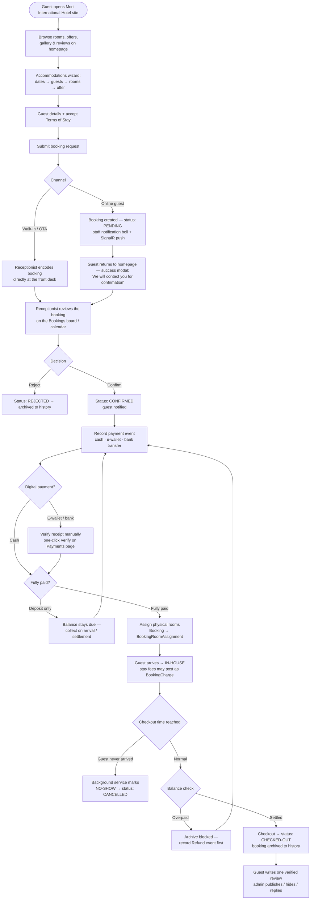
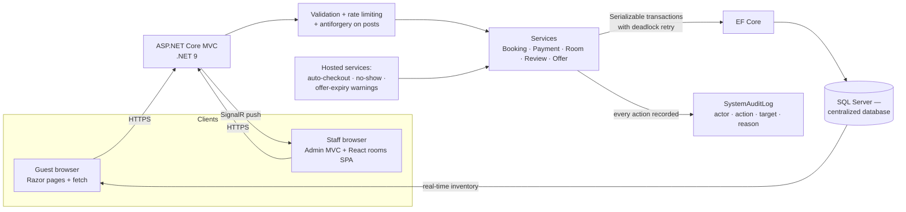
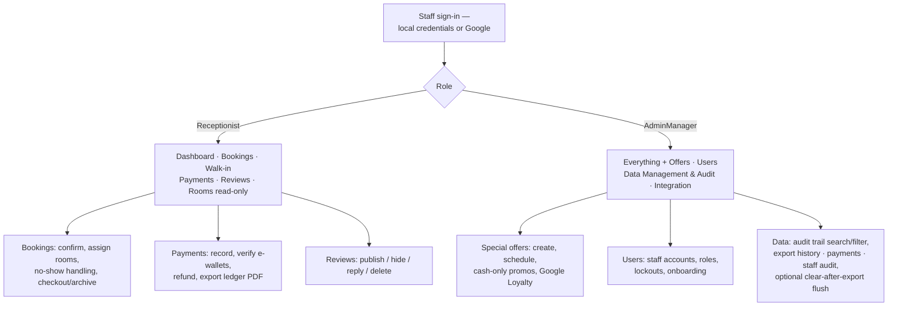

# Mori International Hotel — Proposed Flow of the System

This document describes the proposed flow of the system — the sequence of processes
and interactions within the application. Guests book rooms through the public website,
and staff record bookings, payments, room assignments, and refunds directly into a
centralized web-based database that automatically logs every activity to the audit
trail. Staff can search, filter, and view real-time room availability, booking lists,
payment ledgers, and transaction history without paper or spreadsheets.

## 1. End-to-end booking flow

## 2. What happens inside the system on every action

Every screen above reads and writes through the same pipeline — this is the
"centralized web-based database that automatically logs all activity":

## 3. Staff-side administration flow

## 4. Key rules the flow enforces

| Rule | Where it happens |
|---|---|
| Rooms are only deducted once a booking is Pending/Confirmed — availability is always live | `BookingService` + room-type availability counts |
| A booking can only be confirmed with rooms **after** it is fully paid | `EnsureFullyPaidForRoomAssignmentAsync` |
| Payments are an append-only ledger — corrections are refunds/voids, never edits | `PaymentRecord` |
| An overpaid stay cannot be archived until a refund is posted | `CheckoutAsync` gate + refund modal |
| Confirmed guests who never arrive become **Cancelled** (no-show), not checked out | `AutomaticCheckoutBackgroundService` |
| One review per booking, only after checkout | unique index on `StayReview.BookingId` |
| Every action lands in `SystemAuditLog` with actor, action, target, and reason | `SystemAuditRecorder` on each service |
| Exports are PDF; "clear after export" keeps rows that still hold payment receipts | `SystemFlushService` |

## 5. Automation running alongside the flow

- **Auto-checkout / no-show loop** — every 15 seconds; archives completed stays,
  cancels confirmed no-shows, fires 10-minute warnings.
- **Offer expiry warnings** — flags promos nearing their end date to staff.
- **Realtime notifications** — SignalR pushes booking, payment, and review events to
  every open staff screen (bell + page badges) without refresh.
- **Audit retention** — staff audit exports can be flushed after export; history and
  payment exports are capped per run and keep receipt-bearing stays.
